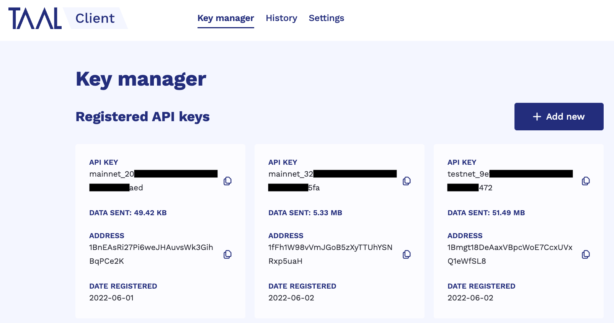
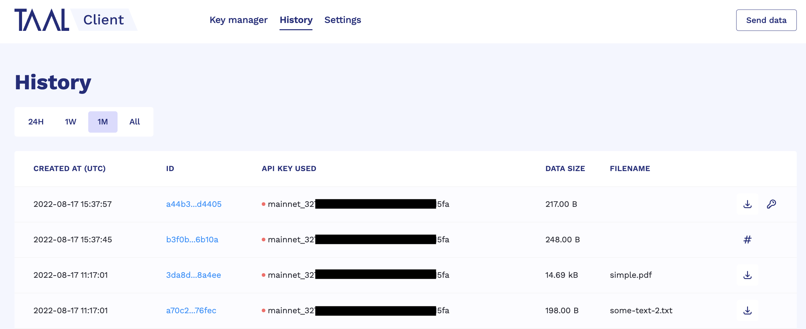

# TAAL Client

## Overview

TAAL Client is a service that runs on the server of a TAAL customer and interacts with [TAPI](https://docs.taal.com/core-products/transaction-processing/taal-transaction-endpoints). You can use the TAAL Client to upload data onto the BSV Blockchain without the need to construct and fund raw transactions.

You can install and download the TAAL Client and obtain a valid TAAL API key. You can provide the data, and the TAAL component constructs a script stack to include the date (OP_Return) and finds the transaction (valid inputs) from the TAAL’s treasury. TAAL Client then signs the transaction and TAAL submits the signed transaction.

All the private keys used for signing a customer's transactions are held only on the customer's server.

The use of TAAL Client service is subject to fees as per the Transaction Agreement.

## Installation

Binaries for Linux, Mac and Windows can be found at https://cdn.taal.com.

## Console

When starting TAAL Client from the command line a console application will be started on http://localhost:9500. It gives easy access to all the functions of TAAL Client.

## Direct Usage

TAAL Client starts listening for HTTP requests on port 9500. This value along with other settings can be changed via the [Settings](https://localhost:9500/settings) page or in the [settings.conf](./settings.conf) file directly. In case of the latter, TAAL Client has to be restarted for the changes to take effect.

All requests will be sent to https://api.taal.com by default unless changed in the settings.

## Database

By default, TAAL Client creates a local database with the filename `taal_client.db` where API keys with public-private key pairs and transaction information are stored. Instead of connecting to a local DB it is possible to connect TAAL Client to a Postgres DB. In order to do that, the database mode has to be changed via [Settings](https://localhost:9500/settings) from `local` to `remote`. The same change can be done by the setting `dbType` from `sqlite` to `postgres` in the [settings.conf](./settings.conf) file. The hostname, port, user, db name, and password have to be configured accordingly, again via settings.

## Functions

### Registration

For TAAL Client use, a valid Taal API key needs to be registered in order to bind it with a public key. For more details, see the [Get an API key](https://docs.taal.com/introduction/get-an-api-key) page.

1. Register at https://console.taal.com
2. Obtain a TAAL Client plan which best suits your needs
3. Make sure that TAAL Client is running
4. Register the API key issued with the plan in TAAL Client by clicking "Add new" on the [Key-manager](https://localhost:9500/key-manager) page

This key is stored in the database with the public-private key pair. When creating transactions the key pair never leaves the machine.

The following image shows the [Key-manager](https://localhost:9500/key-manager) page.



The following image describes the registration of the API key on the TAAL Client.


### Writing data

Currently data can be submitted in 3 different modes

1. Raw: The full data is submitted to the blockchain as raw data.
2. Hash: A SHA256 hash is created of the input data. Only this hash is submitted. Transactions submitted in this mode are denoted by a hash (#️⃣) symbol.
3. Encrypt: Data is encrypted by the given secret using AES encryption. The secret is stored in the local database. When downloading the data, the stored secret is used for decryption. Transactions with encrypted data is denoted by a key (🔑) symbol.

After starting the TAAL Client by running `taal-client` on the command line, you can then write data to the blockchain. On the [Send-data](http://localhost:9500/send-data) page multiple files can be drag-and-dropped to the `File` area. Upon clicking the button `Submit transactions` the data will be submitted in the chosen mode, each in a separate transaction.


Additionally the [Send-data](http://localhost:9500/send-data) page offers a Developer mode which allows users to enter data as pure text. The call to the TAAL Client API will be displayed as a cURL command. In the Developer mode it is only possible to submit individual transactions.


Alternatively data can be written to the blockchain by POSTing directly to the TAAL Client API.

```c
curl --location --request POST 'http://localhost:9500/api/v1/transactions' \
--header 'X-Tag: AN_OPTIONAL_TAG' \
--header 'X-Mode: <raw|hash|encrypt>' \
--header 'X-Key: A_SHARED_SECRET_KEY' \
--header 'Authorization: Bearer <API key>' \
--header 'Content-Type: application/json' \
--data '{
    "key1": "value1",
    "key2": "value2"
}'
```

The header `X-Key` is only needed in mode `encrypt`

A file can be POSTed by using the --data-binary flag:

```c
curl --location --request POST 'http://localhost:9500/api/v1/transactions' \
--header 'X-Mode: raw' \
--header 'Authorization: Bearer <API key>' \
--header 'Content-Type: image/png' \
--data-binary @myimage.png
```

The following diagram shows the different steps that happen when writing data.


### Transaction history

Information about transactions which have been made through TAAL Client are stored in a local database. This information includes ID, data size and timestamp. The history of all these transactions can be viewed on the [History](https://localhost:9500/history) page of the console.



Alternatively data can be read by GETing from the TAAL Client API.

```c
curl --location --request GET 'http://localhost:9500/api/v1/transactions/?hours_back=24'
```

If the `hours_back` parameter is not set, then the whole transaction history will be returned.

### Reading data

You can read data from the blockchain by clicking the Download button <svg width="15" viewBox="0 0 24 24" fill="none" xmlns="http://www.w3.org/2000/svg"><path fill-rule="evenodd" clip-rule="evenodd" d="M12 3C12.5523 3 13 3.44772 13 4V13.5858L15.2929 11.2929C15.6834 10.9024 16.3166 10.9024 16.7071 11.2929C17.0976 11.6834 17.0976 12.3166 16.7071 12.7071L12.7071 16.7071C12.3166 17.0976 11.6834 17.0976 11.2929 16.7071L7.29289 12.7071C6.90237 12.3166 6.90237 11.6834 7.29289 11.2929C7.68342 10.9024 8.31658 10.9024 8.70711 11.2929L11 13.5858V4C11 3.44772 11.4477 3 12 3ZM4 15C4.55228 15 5 15.4477 5 16V17C5 17.5304 5.21071 18.0391 5.58579 18.4142C5.96086 18.7893 6.46957 19 7 19H17C17.5304 19 18.0391 18.7893 18.4142 18.4142C18.7893 18.0391 19 17.5304 19 17V16C19 15.4477 19.4477 15 20 15C20.5523 15 21 15.4477 21 16V17C21 18.0609 20.5786 19.0783 19.8284 19.8284C19.0783 20.5786 18.0609 21 17 21H7C5.93913 21 4.92172 20.5786 4.17157 19.8284C3.42143 19.0783 3 18.0609 3 17V16C3 15.4477 3.44772 15 4 15Z" fill="currentColor"/></svg> in the [History](https://localhost:9500/history) page of the console.

Alternatively data can be read by GETing from the TAAL Client API.

```c
curl --location --request GET 'http://localhost:9500/api/v1/transactions/<txid>' \
--header 'Authorization: Bearer <API key>'
```

## Before usage (MacOS / Linux version)

Before running the `taal-client` binary, make sure it is executable by running

```
chmod 755 taal-client
```

### MacOS

For the Mac version the code is not signed with a certificate issued by Apple currently. Therefore when running for the first time the following message will be shown.


In order to still run the application, please open `Security & Privacy` settings and click on `Open Anyway` as shown in the following picture.


After that when running the application the following message will be shown. This time it has an `Open` button. Press this button to run the application.


